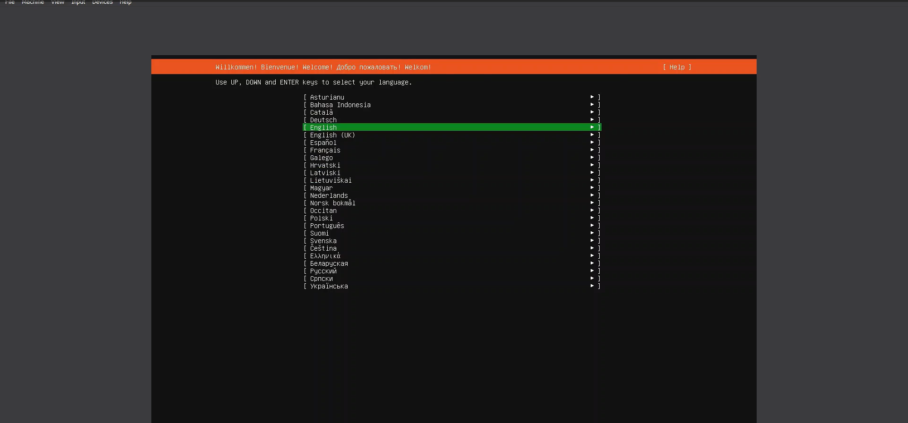
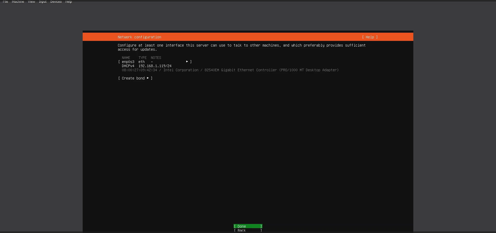
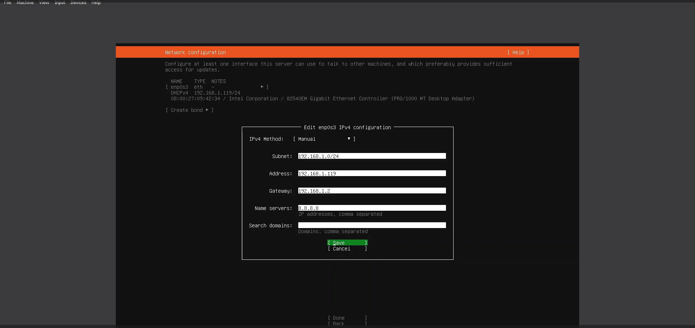
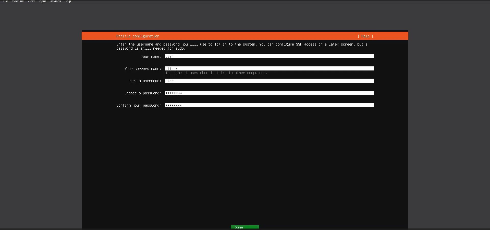
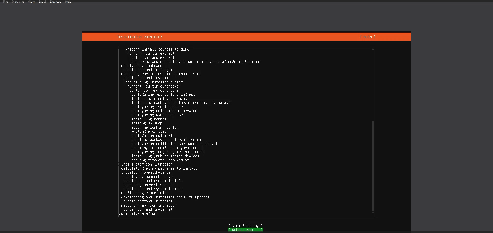
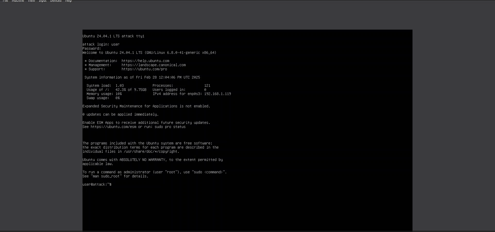
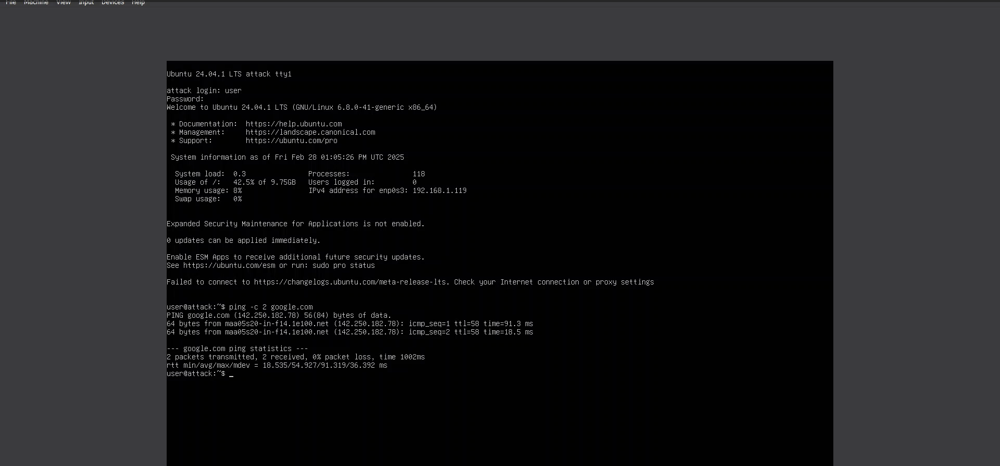

### **Cybersecurity SOC Analyst Lab**

#### **Project Overview**  
This lab is designed to simulate a Security Operations Center (SOC) environment where aspiring cybersecurity analysts can develop skills in threat detection, incident response, and adversary emulation. The lab utilizes a combination of defensive and offensive security tools to create realistic attack scenarios and analyze security events.  

#### **Objectives**  
- Configure and monitor security logs using **Sysmon** and **LimaCharlie**.  
- Conduct adversary emulation using **Sliver C2** to simulate real-world cyber threats.  
- Utilize **Ubuntu Server** and **Windows 10** to create a hybrid infrastructure for testing security measures.  
- Detect and analyze malicious activity through endpoint logging and response mechanisms.  

#### **Lab Setup**  

##### **1. Infrastructure**  
- **Ubuntu Server**: Acts as the central log aggregation and SIEM platform, hosting security tools for monitoring activities.  
- **Windows 10**: Functions as a target endpoint for threat detection and logging analysis.  

##### **2. Security & Attack Tools**  
- **Sysmon**: Installed on Windows 10 for detailed event logging, providing insights into processes, registry changes, network connections, and file activities.  
- **LimaCharlie**: A cloud-native security operations platform used for endpoint detection and response (EDR), threat hunting, and automated remediation.  
- **Sliver C2**: A powerful command-and-control framework for red teaming exercises, allowing adversary emulation to assess detection capabilities.  

#### **Implementation Steps**  
1. **Deploy Ubuntu Server and Windows 10** with necessary configurations.  
2. **Install Sysmon** on Windows 10 and configure logging rules to monitor suspicious activities.  
3. **Set up LimaCharlie** for endpoint monitoring and create custom detections for malicious behavior.  
4. **Deploy Sliver C2** to simulate cyber threats, including persistence, privilege escalation, and lateral movement techniques.  
5. **Analyze logs** from Sysmon and LimaCharlie to investigate adversary activities and generate incident reports.  
6. **Tune detection rules** based on findings to improve threat visibility and response actions.  

#### **Expected Outcomes**  
- Develop hands-on experience with cybersecurity monitoring tools.  
- Gain practical knowledge in detecting and mitigating cyber threats.  
- Enhance skills in log analysis, incident response, and threat hunting.  
- Improve understanding of adversary techniques used in real-world cyber attacks.

## *Walkthrough | Screenshots*

**Installing Ubuntu Server 24.04.1**

      
